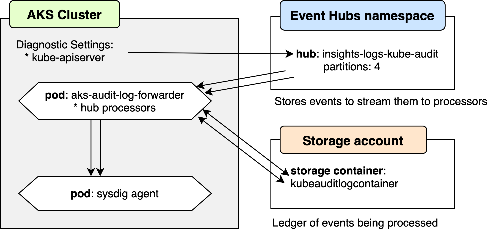

# Azure Kubernetes Service audit log integration to Sysdig Secure

## Introduction

This is de developmend documentation for the _AKS audit log_ integration. To read the _user documentation_, check the [main README.md] of this repo.

## Motivation

Sysdig Secure can do detections based on runtime security policies for Kubernetes commands. To be able to do so, it has to receive the Kubernetes audit log.

In vanilla Kubernetes installations, you can tell the Kubernetes API server to send it to the Sysdig agent. For managed clusters, each cloud provider requires different steps to be able for the Sysdig agent to receive the log.


## Architecture



## Implementation

The [AKSKubeAuditReceiverSolution](../AKSKubeAuditReceiverSolution) has been implemented using .NET core 3.1. And is packaged in a container image that you deploy in the AKS cluster.

We evaluated to use a go Event Hubs client library, but it required to create a specific Service Account for it, which is something that can be problematic in environments where the user doesn't have owner access to the whole Azure account.

You also need additional resources specified in the architecture diagram to be able to access and process the Kubernetes audit log for an AKS cluster.

## Dependencies

Tested with AKS created with Kubernetes version 1.15.10


## Manual deployment

1. Create several Azure resources:
   * Resource Group
   * Create an Events Hub in the Resource Group
   * Create a Log Analytics Workspace (take note of the zone used)  
    We will use it to test queries for the logs, but _it's not required_. 

2. Create AKS cluster, using a new Log Analytics Workspace in the same Resource Group and using the same zone as the Log Analytics Workspace.  
Take into consideration that if you create the Log Analytics in the same step that the AKS cluster, it will not be created in your Resource group, even if it says it will be.

3. Visit "Diagnostics settings" in cluster, activate:
   * log:
       * kube-apiserver: No
       * kube-audit: Yes
       * kube-controller-manager: No
       * kube-scheduler: No
       * cluster-autoscaler: No
   * metric:
       * AllMetrics: No
   * Send to Log Analytics: Yes
       * Subscription: \<your subscription>
       * Log Analytics workspace: \<your Log Analytics workspace>
   * Stream to an event hub
       * Subscription: \<your subscription>
       * Event hub namespace: \<your Event Hubs>
       * Event hub name: (leave blank)
       * Event hub policy name: RootManagedSharedAccessKey (default value)
   * Archite to a storage account: No
   * Stream to an event hub: Yes
       * Subscription: \<your subscription>
       * Event hub namespace: \<your Event Hubs>
       * Event hub name (optional): (leave blank)
       * Event hub policy name: RootManageSharedAccessKey (default)

4. Set up `kubectl` access to the cluster

```bash
az login
az az aks get-credentials --resource-group $group --name $cluster_name
```

5. If your cluster is empty, deploy an Nginx pod to test the logs

```bash
kubectl apply -f nginx.yaml
```

6. Visit Log Analytics workspace  
   Click on the **Logs** section, and run some test queries (you may have to wait a while until results show).
   Your results should look like the ones from [samples/aks_audit.csv](./aks_audit.csv).

```
AzureDiagnostics
| where Category == "kube-audit"
| project log_s
```

7. Install Sysdig agent

   * Install the agent using the bash script provided when you create a new Sysdig account at [./install-agent-kubernetes] using:

   
```bash
# Replace <YOUR_SYSDIG_ACCESS_KEY> and <CLUSTER_NAME>
curl -s https://download.sysdig.com/stable/install-agent-kubernetes | bash -s -- --access_key <YOUR_SYSDIG_ACCESS_KEY> --collector collector.sysdigcloud.com --collector_port 6443 --cluster_name <CLUSTER_NAME> --imageanalyzer
```

  * Deploy service definition for Sysdig's agent webhook

```bash
kubectl apply -f service.yaml
```


8. Deploy the AKS Audit Log consumer-forwarder

  * Execute:

```bash
# Replace YOUR_EVENT_HUB_CONNECTION_STRING and YOUR_BLOB_STORAGE_CONNECTION_STRING
EhubNamespaceConnectionString="YOUR_EVENT_HUB_CONNECTION_STRING" \
  BlobStorageConnectionString="YOUR_BLOB_STORAGE_CONNECTION_STRING" \
  envsubst < deployment.yaml.in > deployment.yaml
```

  * Wait until it's deployed, and you can check it's logs at:
  
```
kubectl get pods -n sysdig-agent
kubectl logs <AKS_KUBE_AUDIT_POD_NAME> -n sysdig-agent
```

## References

### Azure documendation:

* [Enable and review Kubernetes master node logs in Azure Kubernetes Service (AKS)](https://docs.microsoft.com/en-us/azure/aks/view-master-logs)

* [Stream Azure platform logs to Azure Event Hubs](https://docs.microsoft.com/en-us/azure/azure-monitor/platform/resource-logs-stream-event-hubs)

* [Azure Event Hubs as an Event Grid source](https://docs.microsoft.com/en-us/azure/event-grid/event-schema-event-hubs)

* [Azure Event Hubs receive events](https://docs.microsoft.com/en-us/azure/event-hubs/get-started-dotnet-standard-send-v2#receive-events)

* [Azure Event Hubs receive events (old version, more detailed)](https://docs.microsoft.com/en-us/azure/event-hubs/event-hubs-dotnet-standard-getstarted-send#receive-events)

* [Azure Events Hubs go library client](https://github.com/Azure/azure-event-hubs-go)

### Sysdig documentations and repositories:

* [Sysdig documentation for Kubernetes audit log integrations](https://docs.sysdig.com/en/kubernetes-audit-logging.html)

* [Sysdig agent Helm chart](https://github.com/helm/charts/blob/master/stable/sysdig/README.md)

* [GitHub repo: EKS Kubernetes audit log integration](https://github.com/sysdiglabs/ekscloudwatch)

* [GitHub repo: GKE Kubernetes audit log integration](https://github.com/sysdiglabs/stackdriver-webhook-bridge)

### Other related documentation:

* [GitHub repo folder: Falco samples for Kubernetes audit log events](https://github.com/falcosecurity/falco/tree/master/test/trace_files/k8s_audit)

* [Get kubelet logs from Azure Kubernetes Service (AKS) cluster nodes](https://docs.microsoft.com/en-us/azure/aks/kubelet-logs)

* [Connect with SSH to Azure Kubernetes Service (AKS) cluster nodes for maintenance or troubleshooting](https://docs.microsoft.com/en-us/azure/aks/ssh)


